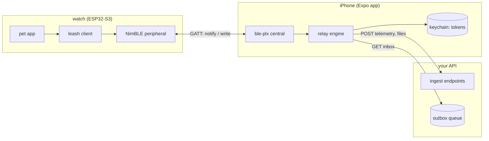
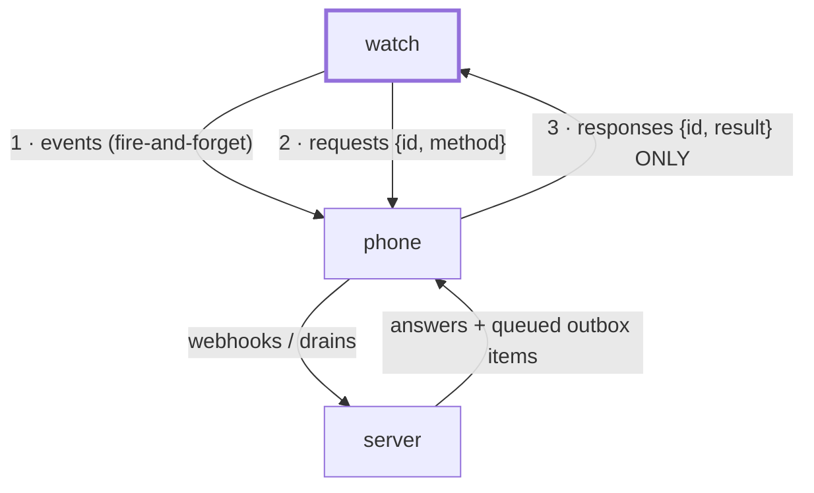
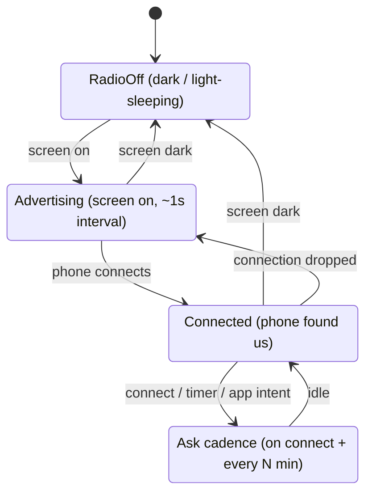
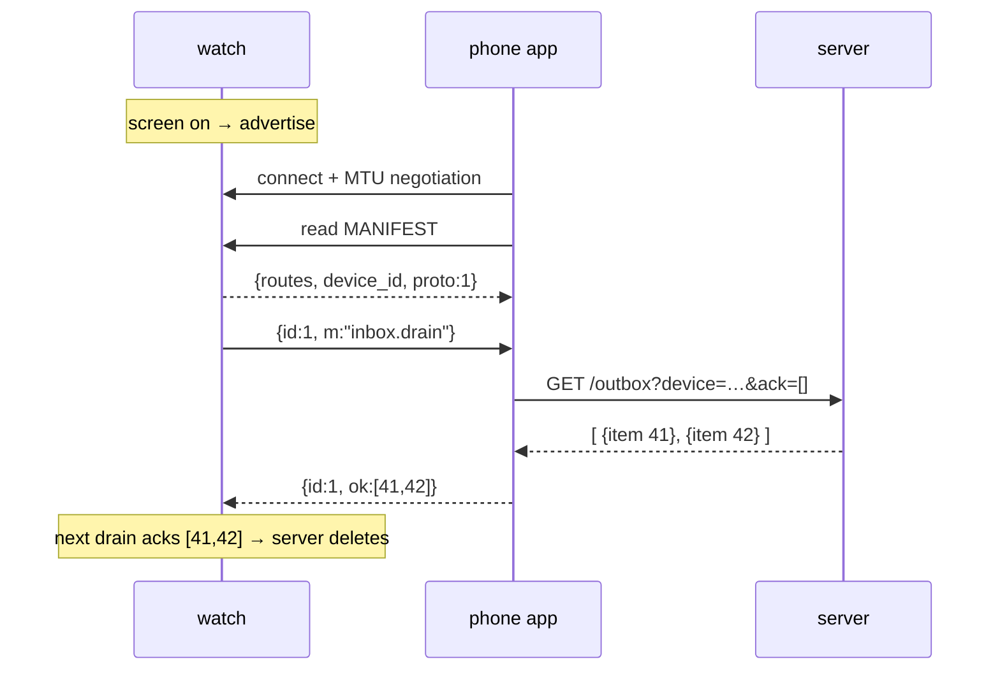
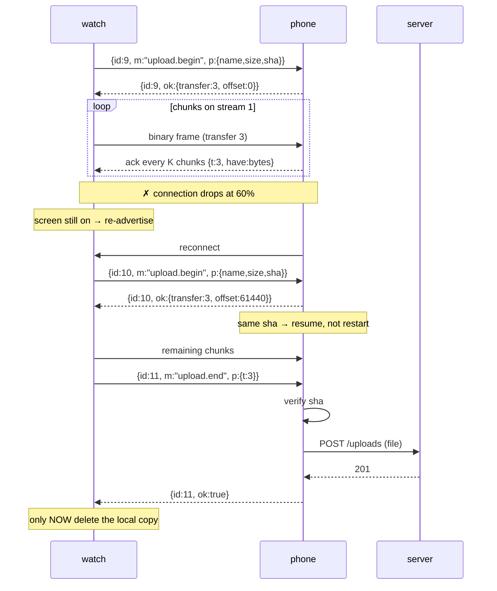
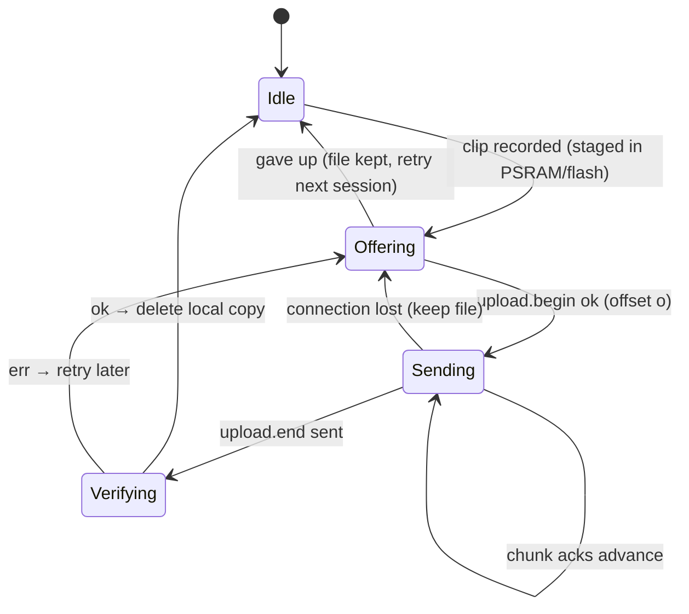
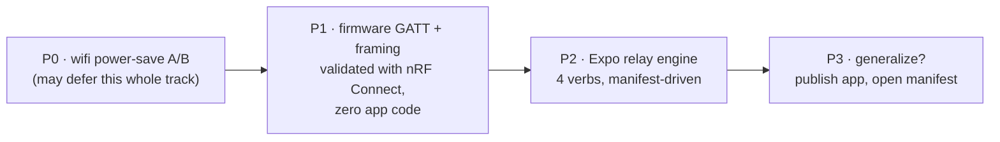

# Leash — device-initiated BLE gateway

*Design doc, 2026-08-13. Status: proposed (no firmware or app code exists yet).*

The watch talks to the internet through the phone over BLE, replacing wifi
as the daily transport. One invariant governs everything:

> **All intent originates on the device.**
> The watch pushes when it wants, asks when it needs. The phone only
> relays; the server only queues. Nothing upstream can demand the watch's
> attention — which matches the radio physics: a sleeping watch has no
> radio to demand attention from.

## The pieces



The phone app holds **no product logic**. It wakes when the watch speaks,
does what the watch asks (using routes from the watch's own manifest),
and goes back to sleep. New watch behavior never requires an app update.

## Who may say what



A phone→watch write that carries no known request `id` is a protocol
error and is dropped. There is no path for the server or phone to
initiate anything — deleting APNs push infrastructure, the device-side
pending-request table, and every unsolicited-message edge case.

## GATT layout

One service, three characteristics. Everything conversational shares one
duplex framed channel; the manifest is a plain read.

| Characteristic | Props | Carries |
|---|---|---|
| `MANIFEST` | read | Device-authored JSON: identity, routes, protocol version |
| `TX` | notify | Watch → phone frames (events, requests, file chunks) |
| `RX` | write | Phone → watch frames (responses, download chunks) |

The watch controls the session at every layer: **advertising is the
device saying "open for business."** Radio dark = nothing exists to
connect to.

## Session lifecycle (watch side)

Mirrors the existing radio-follows-screen policy — BLE simply replaces
wifi in the same slot.



`sleep_eligible` keeps its rule: no light sleep until the radio is torn
down. (Later, if measurements allow: µA-cheap advertising could continue
during doze — a deliberate phase-2 experiment, not the default.)

## Framing: fitting frames through an MTU straw

BLE writes/notifies cap at the negotiated MTU (iOS grants ~185 bytes
typically). Every message rides length-prefixed frames; anything bigger
is fragmented and reassembled. Same framing both directions.

```text
frame  :=  [ len:u16 ] [ flags:u8 ] [ stream:u8 ] [ payload ≤ MTU-7 ]

flags  :   bit0-1  kind      00 = JSON message   01 = binary chunk
           bit2-3  position  00 = only frame     01 = first
                             10 = continuation   11 = last
stream :   reassembly lane (interleave bulk transfer with control chat)
```

- **kind=JSON**: reassembled frames concatenate into one UTF-8 JSON doc.
- **kind=binary**: raw chunk of an in-flight file transfer (no JSON tax
  on audio).
- Two streams are enough: `0` control, `1` bulk.

## Envelope: three message shapes, one initiator

JSON-RPC-flavored, minus everything a single-initiator design doesn't
need. The watch keeps one small table of its own outstanding requests
(id → timeout); the phone answers statelessly.

```json
// event — fire-and-forget, no reply expected
{ "ev": "telemetry", "data": { "steps": 4211, "bat": 87 } }

// request — watch asks, phone must answer this id
{ "id": 7, "m": "inbox.drain", "p": { "max": 10 } }

// response — the only thing a phone may ever send unprompted-looking
{ "id": 7, "ok": [ { "kind": "msg", "body": "..." } ] }
{ "id": 7, "err": { "code": "http_502", "msg": "upstream down" } }
```

Rules that keep it boring: every request has a **timeout** (default 10s);
every method is **idempotent** (re-asking is always safe — the outbox
drain acks by item id, so a lost response never loses a message).

## The verbs (v1: exactly four)

| Verb | Shape | Phone does |
|---|---|---|
| `telemetry` | event | POST to the manifest's telemetry route |
| `inbox.drain` | request | GET outbox route, return items; watch acks item ids in the next drain |
| `upload.begin / .end` | request | Open/close a staged file; on `.end`, verify sha and POST to upload route |
| *(binary frames)* | stream 1 | Append chunks to the staged file, ack every K chunks |

## Call stacks, visually

### Boot of a session: connect, read manifest, drain



### Telemetry: fire and forget

```mermaid
sequenceDiagram
    participant W as watch
    participant P as phone (may be backgrounded)
    participant S as server
    W->>P: notify {ev:"telemetry", data:{steps,bat}}
    Note over P: iOS wakes app ~10s (bluetooth-central)
    P->>S: POST /telemetry  (auth from keychain)
    Note over W: no reply expected; loss is fine,<br/>next telemetry supersedes
```

### Voice clip upload, with a mid-transfer connection drop



### Server wants to tell the watch something

```mermaid
sequenceDiagram
    participant S as server
    participant P as phone
    participant W as watch
    S->>S: enqueue item in outbox (that's all it can do)
    Note over S,W: …time passes; nobody can push…
    W->>P: {id:12, m:"inbox.drain"}  (screen-on or N-min timer)
    P->>S: GET /outbox
    S-->>P: [item]
    P-->>W: {id:12, ok:[item]}
```

Downstream latency is bounded by the watch's ask cadence — by design.
"Now" doesn't exist for a device whose radio sleeps.

## Transfer state machine (watch side)



## The manifest

Authored in firmware, served over GATT, versioned with the protocol.
The phone resolves `auth` names against its keychain — **the manifest is
not secret** (it ships in a firmware binary); tokens never leave the
phone.

```json
{
  "proto": 1,
  "device": "pikachu-01",
  "routes": {
    "telemetry": { "post": "https://api.frolic.dev/pet/telemetry", "auth": "frolic" },
    "inbox":     { "get":  "https://api.frolic.dev/pet/outbox",    "auth": "frolic" },
    "uploads":   { "post": "https://api.frolic.dev/pet/uploads",   "auth": "frolic" }
  },
  "hosts_allow": ["api.frolic.dev"]
}
```

`hosts_allow` is the relay's safety rail: the engine refuses any route
outside it, so a generic public version of the app can't be turned into
an open proxy by a hostile device.

## Budgets and constraints

| Concern | Number | Note |
|---|---|---|
| NimBLE stack RAM | ~25-30KB | vs ~40-70KB free heap today → needs a memory pass first |
| Throughput (GATT, iOS) | ~5-50 KB/s | 30s voice clip ≈ 60-100KB ≈ seconds-to-half-minute |
| iOS background wake | ~10s per BLE event | every phone action must fit one slice |
| Advertising cost | tens of µA | phase-2 candidate: keep advertising while dozing |
| Frame payload | MTU−7 (~178B) | after iOS's typical 185-byte MTU grant |

## Phasing



- **P0** — flip `WIFI_PS_NONE` → modem power-save (truce-era relic),
  measure with the AXP2101 fuel gauge. If wifi gets cheap enough, BLE
  waits.
- **P1** — NimBLE peripheral + manifest + framed channel in firmware;
  drive it entirely from nRF Connect. The watch side is done before any
  app exists.
- **P2** — Expo dev-build app (`react-native-ble-plx`), relay engine
  with the four verbs, keychain auth, background mode.
- **P3** — only if wanted: the app was generic all along; open it up.

## Open questions

1. **BLE while dozing?** Advertising is µA-cheap, but the manual
   light-sleep loop and the BT controller's sleep clocking need a
   deliberate experiment (same rigor as the render harness).
2. **Chunk size / ack window (K)** — tune on the bench with nRF Connect
   throughput tests before freezing the protocol.
3. **Pairing/bonding** — v1 can rely on the manifest's allowlist + app
   pinning by device id; decide whether BLE-level bonding is worth its
   iOS UX friction.
4. **Coexistence** — wifi and BLE share the 2.4GHz radio. v1: BLE
   replaces wifi in the screen-on slot. Running both is a measured
   experiment, not an assumption.
