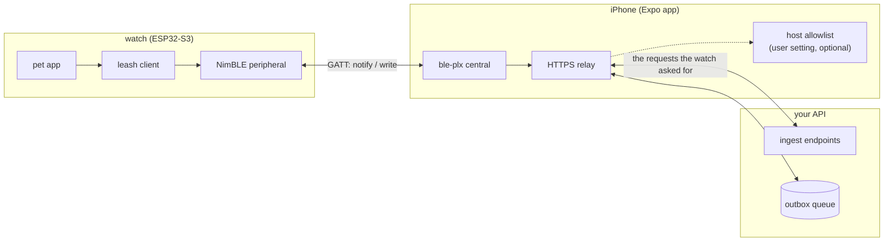
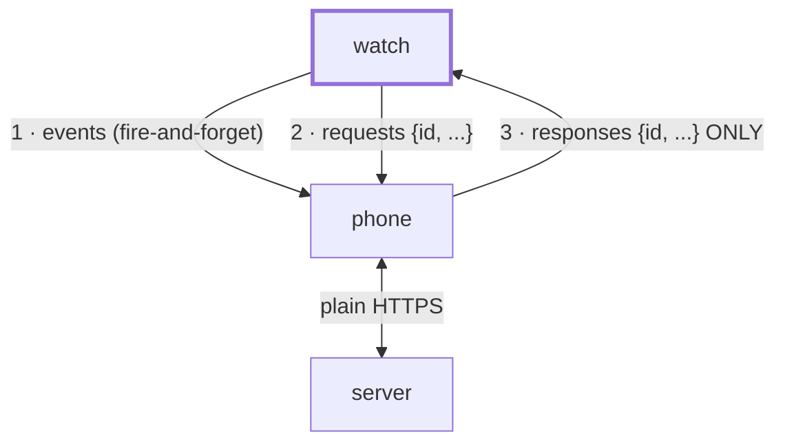
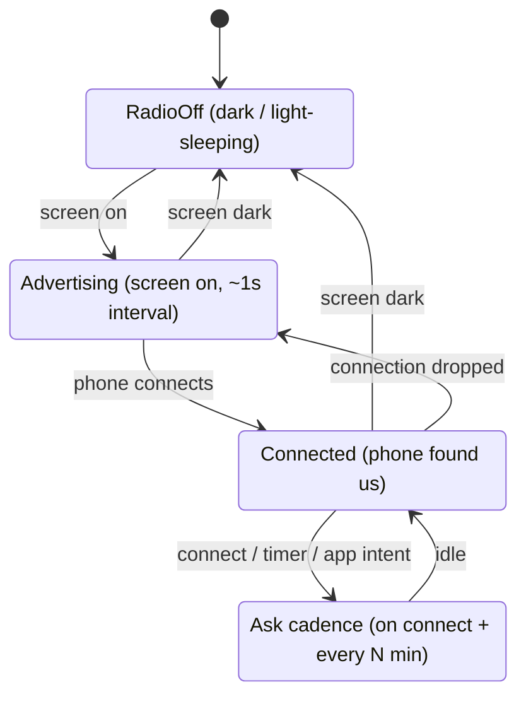
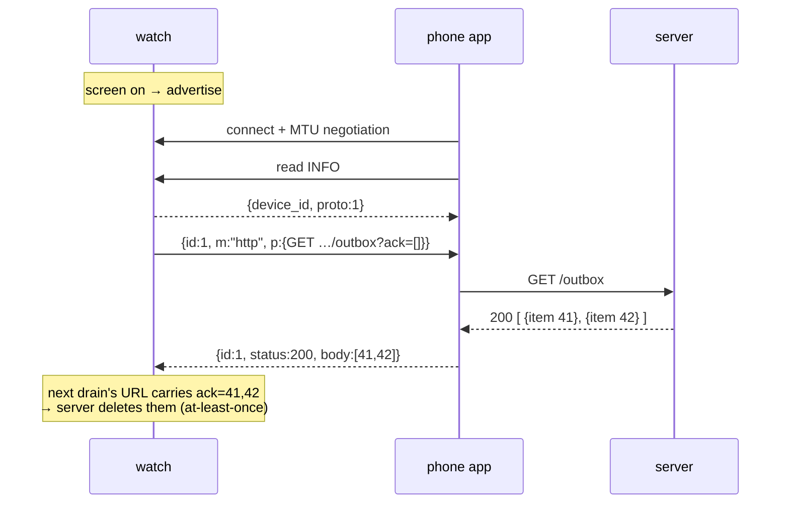
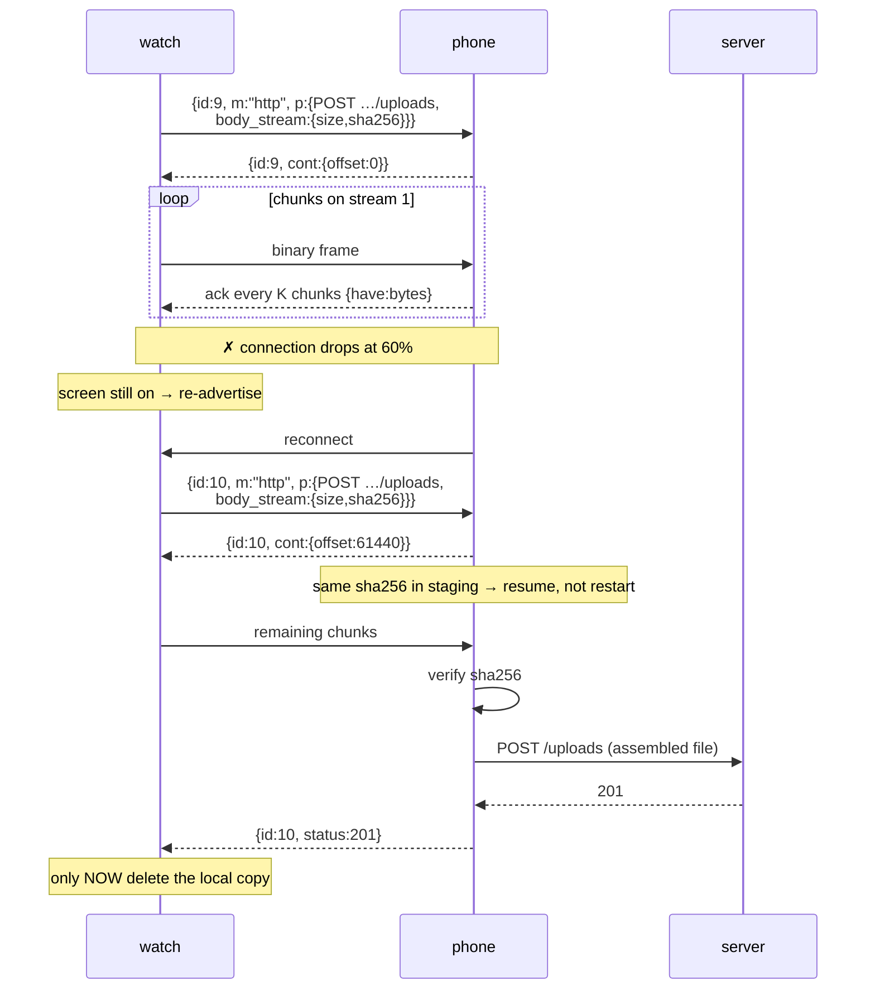
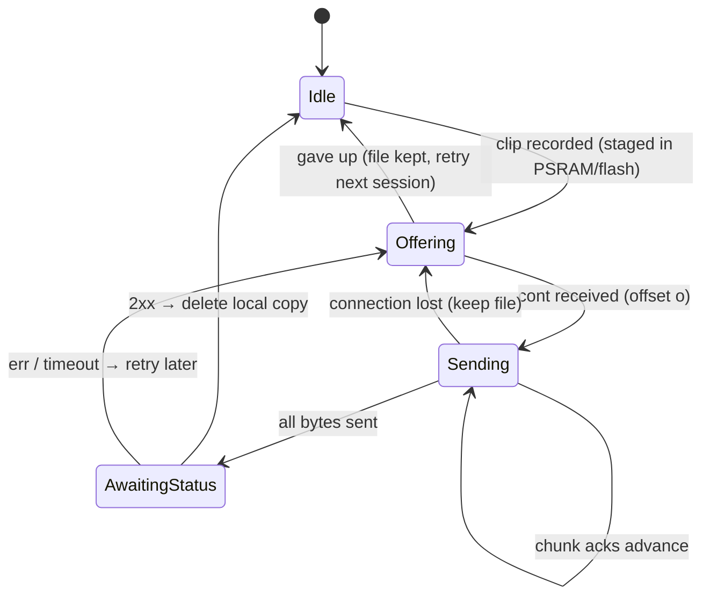
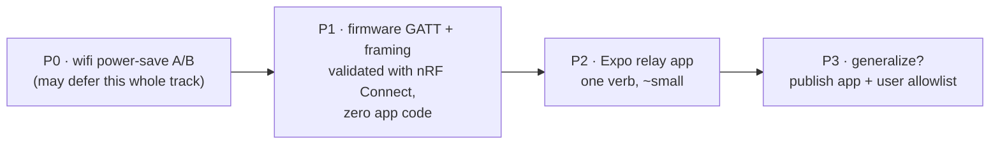

# Leash — device-initiated BLE gateway

*Design doc v2, 2026-08-13. Status: proposed (no firmware or app code
exists yet). v2 removes the manifest/routes layer: the device includes
URLs directly, the phone is a dumb HTTPS proxy.*

The watch talks to the internet through the phone over BLE, replacing wifi
as the daily transport. One invariant governs everything:

> **All intent originates on the device.**
> The watch pushes when it wants, asks when it needs. The phone only
> relays; the server only queues. Nothing upstream can demand the watch's
> attention — which matches the radio physics: a sleeping watch has no
> radio to demand attention from.

And one job description:

> **The watch makes HTTP calls. BLE is just the wire. The phone is just
> the modem.**

## The pieces



The phone app holds **no product logic and no configuration about the
watch**. It executes HTTP requests the watch hands it, returns the
responses, and goes back to sleep. New watch behavior never requires an
app update.

## Who may say what



A phone→watch write that carries no known request `id` is a protocol
error and is dropped. There is no path for the server or phone to
initiate anything — no push infrastructure, no device-side handler for
unsolicited messages, no bidirectional-RPC edge cases.

## Delivery guarantees (what BLE gives, what we add)

What the radio itself promises — this shapes the whole envelope:

| Layer | Guarantee |
|---|---|
| Link layer, live connection | Every packet ACKed + retransmitted, **strict ordering**, no silent loss — TCP-like. This covers notifications too, despite their "unacknowledged" name (that refers to the ATT layer, not the radio). |
| Sender's local queue | Fail-fast: if the stack's buffer is full, the send returns an error — visible, not silent. |
| **Across a disconnect** | **No guarantee.** Trailing in-flight data vanishes, and the sender does not learn which messages survived. Disconnects are common (range, interference, iOS reaping). |

So the one problem the application layer owns is **resume across
disconnects**, and every protocol rule below exists for it:

- Requests carry **ids + timeouts** → a lost response is re-asked.
- Every request is **idempotent** → re-asking is always safe.
- Outbox items are **acked by item id** on the *next* drain → a lost
  response never loses a message (at-least-once, dedup by id).
- File transfers resume by **sha + offset**, and the watch deletes its
  local copy only after the server's 2xx comes back → end-to-end
  at-least-once for uploads.
- Fire-and-forget events are the one place loss is accepted — used only
  where the next event supersedes the last (telemetry).

## GATT layout

One service, three characteristics, one duplex framed channel.

| Characteristic | Props | Carries |
|---|---|---|
| `INFO` | read | `{device_id, proto}` — lets the app pin its watch and version-gate before relaying |
| `TX` | notify | Watch → phone frames (events, requests, chunk stream) |
| `RX` | write | Phone → watch frames (responses, download chunks) |

The watch controls the session at every layer: **advertising is the
device saying "open for business."** Radio dark = nothing exists to
connect to.

## Session lifecycle (watch side)

Mirrors the existing radio-follows-screen policy — BLE simply replaces
wifi in the same slot.



`sleep_eligible` keeps its rule: no light sleep until the radio is torn
down. (Later, if measurements allow: µA-cheap advertising could continue
during doze — a deliberate phase-2 experiment, not the default.)

## Framing: fitting frames through an MTU straw

BLE writes/notifies cap at the negotiated MTU (iOS grants ~185 bytes
typically). Every message rides length-prefixed frames; anything bigger
is fragmented and reassembled. Same framing both directions.

```text
frame  :=  [ len:u16 ] [ flags:u8 ] [ stream:u8 ] [ payload ≤ MTU-7 ]

flags  :   bit0-1  kind      00 = JSON message   01 = binary chunk
           bit2-3  position  00 = only frame     01 = first
                             10 = continuation   11 = last
stream :   reassembly lane (interleave bulk transfer with control chat)
```

- **kind=JSON**: reassembled frames concatenate into one UTF-8 JSON doc.
- **kind=binary**: raw chunk of an in-flight body (no JSON tax on audio).
- Two streams are enough: `0` control, `1` bulk.

## The protocol: one verb

The watch speaks HTTP; the phone executes it. Two message shapes:

```json
// event — fire-and-forget HTTP; no reply, loss acceptable
{ "ev": "http", "p": { "method": "POST",
    "url": "https://api.frolic.dev/pet/telemetry",
    "headers": { "authorization": "Bearer …" },
    "body": { "steps": 4211, "bat": 87 } } }

// request — same shape plus an id; phone MUST answer that id
{ "id": 7, "m": "http", "p": { "method": "GET",
    "url": "https://api.frolic.dev/pet/outbox?ack=41,42" } }

// response — status + body, or a transport error
{ "id": 7, "status": 200, "body": [ { "kind": "msg", "body": "…" } ] }
{ "id": 7, "err": { "code": "offline", "msg": "phone has no internet" } }
```

Large bodies stream instead of inlining:

```json
// upload: body follows as binary chunks on stream 1
{ "id": 9, "m": "http", "p": { "method": "POST",
    "url": "https://api.frolic.dev/pet/uploads",
    "body_stream": { "stream": 1, "size": 102400, "sha256": "ab12…" } } }
```

Auth lives on the device (NVS, same trust boundary as the stored wifi
password). The phone adds nothing and knows nothing.

## Call stacks, visually

### Session start: connect, identify, drain the outbox



### Telemetry: fire and forget

```mermaid
sequenceDiagram
    participant W as watch
    participant P as phone (may be backgrounded)
    participant S as server
    W->>P: notify {ev:"http", p:{POST …/telemetry}}
    Note over P: iOS wakes app ~10s (bluetooth-central)
    P->>S: POST /telemetry
    Note over W: no reply expected; loss is fine,<br/>next telemetry supersedes
```

### Voice clip upload, surviving a mid-transfer drop



### Server wants to tell the watch something

```mermaid
sequenceDiagram
    participant S as server
    participant P as phone
    participant W as watch
    S->>S: enqueue item in outbox (that's all it can do)
    Note over S,W: …time passes; nobody can push…
    W->>P: {id:12, m:"http", p:{GET …/outbox}}  (screen-on or N-min timer)
    P->>S: GET /outbox
    S-->>P: 200 [item]
    P-->>W: {id:12, status:200, body:[item]}
```

Downstream latency is bounded by the watch's ask cadence — by design.
"Now" doesn't exist for a device whose radio sleeps.

## Transfer state machine (watch side)



## No manifest — and when one would earn its way back

v1 deliberately has **no manifest, no routes, no phone-side config**.
The device includes full URLs and its own auth header; the phone relays.
What that choice trades, with open eyes:

- **Secrets live on the device** (NVS) instead of the phone keychain —
  the same trust boundary as the stored wifi password. Fine for a
  personal device; revisit if this ever ships to strangers.
- **The open-proxy rail moves to the phone's user**: if the app is ever
  published generically, an app-side allowlist setting (owned by the
  person whose phone is being used as a modem) gates which hosts a
  device may reach. Nothing to build for v1.

A manifest earns its way back only if third-party devices need to
declare capabilities to a generic app, or secrets must move off-device.
Both are additive later; neither blocks anything now.

## Budgets and constraints

| Concern | Number | Note |
|---|---|---|
| NimBLE stack RAM | ~25-30KB | vs ~40-70KB free heap today → needs a memory pass first |
| Throughput (GATT, iOS) | ~5-50 KB/s | 30s voice clip ≈ 60-100KB ≈ seconds-to-half-minute |
| iOS background wake | ~10s per BLE event | every phone action must fit one slice |
| Advertising cost | tens of µA | phase-2 candidate: keep advertising while dozing |
| Frame payload | MTU−7 (~178B) | after iOS's typical 185-byte MTU grant |

## Phasing



- **P0** — flip `WIFI_PS_NONE` → modem power-save (truce-era relic),
  measure with the AXP2101 fuel gauge. If wifi gets cheap enough, BLE
  waits.
- **P1** — NimBLE peripheral + INFO + framed channel in firmware; drive
  it entirely from nRF Connect. The watch side is done before any app
  exists.
- **P2** — Expo dev-build app (`react-native-ble-plx`): frame codec,
  the `http` executor, staging for streamed bodies, background mode.
- **P3** — only if wanted: the app was generic all along; open it up.

## Open questions

1. **BLE while dozing?** Advertising is µA-cheap, but the manual
   light-sleep loop and the BT controller's sleep clocking need a
   deliberate experiment (same rigor as the render harness).
2. **Chunk size / ack window (K)** — tune on the bench with nRF Connect
   throughput tests before freezing the protocol.
3. **Pairing/bonding** — connection needs NO pairing (any central may
   connect to an open peripheral), so bring-up runs pairing-free with
   nRF Connect. Before real auth tokens transit the link, mark the
   channel characteristics encryption-required: first connect then shows
   iOS's one-time pairing dialog ("Just Works" bonding), the link is
   encrypted thereafter, strangers' phones can connect but read nothing,
   and bonded auto-reconnect gets smoother. The watch's screen even
   allows numeric-comparison pairing later if MITM resistance ever
   matters.
4. **Coexistence** — wifi and BLE share the 2.4GHz radio. v1: BLE
   replaces wifi in the screen-on slot. Running both is a measured
   experiment, not an assumption.
